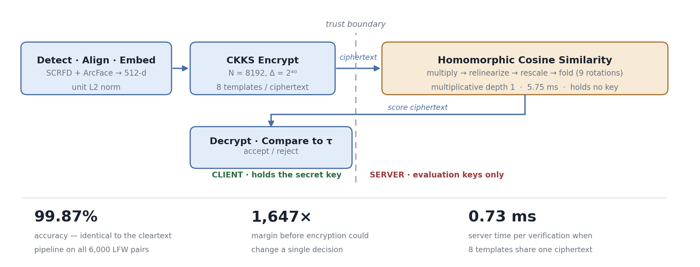
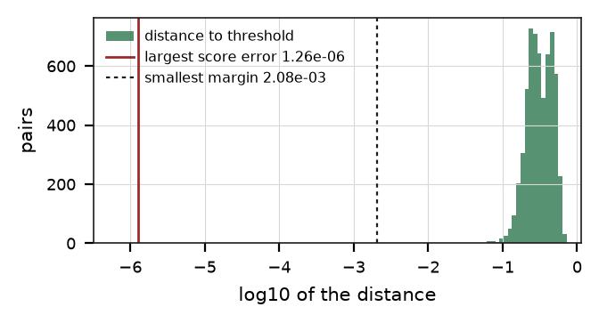
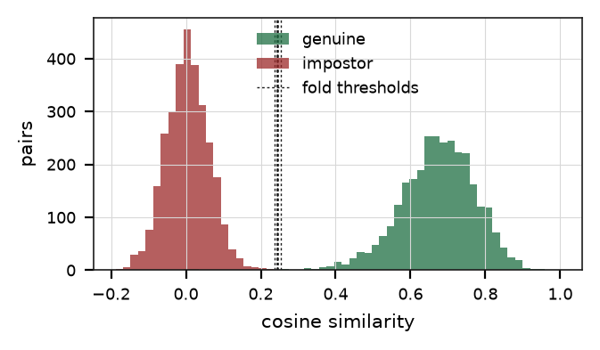
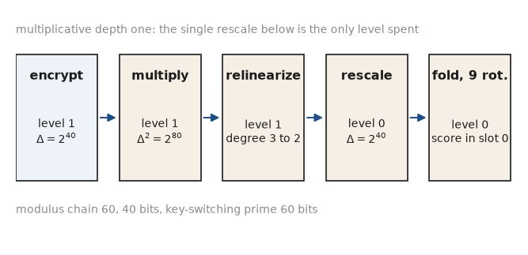
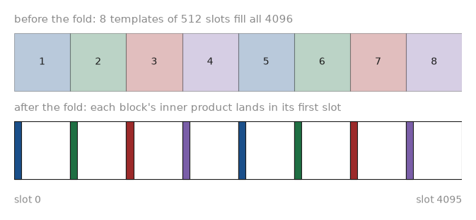
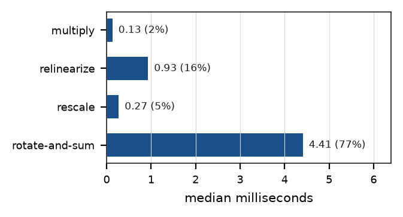
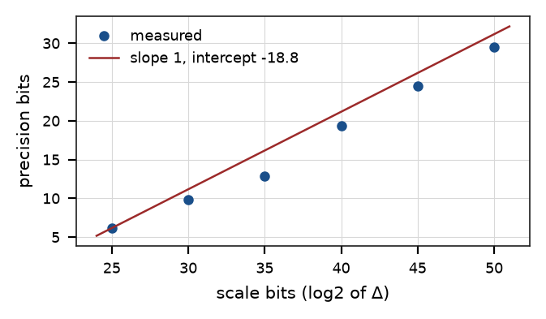

<div align="center">

# Encrypted 1:1 Face Verification under RNS-CKKS

**A face-matching server that holds no key — and a bound, not a count, showing it decides exactly as a cleartext one.**

[](Technical%20Report.pdf)
[](CMakeLists.txt)
[](https://github.com/microsoft/SEAL)
[](http://vis-www.cs.umass.edu/lfw/)
[](LICENSE)



</div>

---

## 📄 Technical report

The full study — method, four propositions with proofs, and every measurement —
is in **[`Technical Report.pdf`](Technical%20Report.pdf)**, typeset in the
Springer LNCS format.

---

## Résumé (français)

Vérification faciale 1:1 sur gabarits chiffrés. Le client dérive un gabarit de
512 dimensions de norme unitaire, le chiffre sous RNS-CKKS et conserve la clé
secrète ; le serveur calcule la similarité cosinus par un unique produit
scalaire homomorphe à profondeur multiplicative 1, sans jamais détenir de clé.

L'apport principal n'est pas le système mais la garantie qu'il porte. Les
travaux existants constatent qu'aucune décision n'a changé lors d'une
exécution ; nous le démontrons par une inégalité entre la plus grande erreur de
score et la plus petite marge de décision, marge rendue strictement positive par
construction. Sur les 6 000 paires du protocole officiel de LFW, ce rapport vaut
6,07 × 10⁻⁴ : l'égalité des deux ensembles de décisions tient avec un facteur
1 647 de réserve, indépendamment du bruit tiré.

---

## ✨ What this repository shows

**1️⃣ Decision equivalence as a bound, not an observation.** A decision depends
on a score only through the sign of its distance to the threshold. So if the
largest score error `E` is below the smallest decision margin `M`, *no* pair can
flip — whatever noise the run drew. Placing every candidate threshold at a
midpoint of the observed score grid makes `M` strictly positive by construction.
Measured: `E/M = 6.07e-4`, a **1,647× margin**.

**2️⃣ A precision model with no fitted constant.** One scale bit buys exactly one
precision bit, so the predicted slope is fixed at 1 and nothing can be tuned to
fit the data. Measured slope **0.957**, R² **0.9880**. The recovered intercept is
the circuit's noise floor, and combining it with `M` gives a design rule:
**log₂Δ > 27.7 bits**, so the working point of 2⁴⁰ carries 12.3 bits of slack.

**3️⃣ A fold schedule justified before it is measured.** Doubling strides against
naive single-slot rotation: predicted **56.8×** in time and **256×** in noise;
measured **57.2×** and **332×**. Nine Galois keys instead of 511.

**4️⃣ Server isolation enforced by the build.** The server library and executable
are compiled without the translation unit that constructs a secret key, and
`tools/check_isolation.sh` verifies this at three depths — sources, compiled
objects, linked executable — while confirming the client library *does*
reference those types, which shows the check discriminates.

---

## Results

| | Cleartext | Encrypted |
|---|---|---|
| Accuracy, 10-fold LFW | 99.87% ± 0.19% | **99.87% ± 0.19%** |
| Area under ROC | 0.999417 | 0.999417 |
| Equal error rate | 0.267% | 0.267% |
| Decisions changed by encryption | — | **0 of 6,000** |

| Cost | Unbatched | 8 per ciphertext |
|---|---|---|
| Server time | 5.75 ms | **0.73 ms** |
| Uplink per verification | 257.1 KiB | **32.1 KiB** |
| Throughput | 174 /s | **1,364 /s** |

<table>
<tr>
<td width="50%"></td>
<td width="50%"></td>
</tr>
<tr>
<td><sub><b>The bound.</b> Every pair's distance to its threshold, against the
largest score error. The gap between them is what makes the two decision sets
provably equal.</sub></td>
<td><sub><b>Why the gap is wide.</b> The fitted thresholds fall in an interval
that almost no pair occupies, which is what puts <code>M</code> three orders of
magnitude above <code>E</code>.</sub></td>
</tr>
</table>

---

## How it works

**The circuit is one inner product at depth 1.** Templates leave the client at
unit L2 norm, so cosine similarity is a dot product: one slot-wise
multiplication and one sum. A single rescale suffices and bootstrapping never
enters.

<div align="center"></div>

**Eight verifications share one pass.** A ciphertext at degree 8192 carries 4096
slots and a template occupies 512, so eight sit side by side. The multiplication
is slot-wise and the fold is block-local, so one pass yields eight independent
scores — each in the first slot of its own block.

<div align="center"></div>

**The client compares, the server evaluates.** A threshold comparison under
encryption needs a polynomial approximation to a step function, and that depth is
deliberately excluded. The consequence is stated rather than hidden: the server
learns the ciphertexts and nothing about their contents, and the client learns
the numeric score.

<table>
<tr>
<td width="50%"></td>
<td width="50%"></td>
</tr>
<tr>
<td><sub><b>Where the time goes.</b> The fold is 77% of server time, which is why
its rotation schedule is worth deriving.</sub></td>
<td><sub><b>Precision against scale bits.</b> Measured points against a slope
fixed at 1 by the scheme, not by a fit.</sub></td>
</tr>
</table>

---

## Parameters

| | |
|---|---|
| Scheme | RNS-CKKS, Microsoft SEAL 4.3.3 |
| Polynomial modulus degree | 8192 → 4096 slots |
| Coefficient modulus | 60, 40, 60 bits — 160 of the 218 that tc128 permits |
| Scaling factor | 2⁴⁰ |
| Multiplicative depth | 1 |
| Rotations per score | 9 (doubling strides) |
| Templates per ciphertext | 8 |
| Host of record | Apple M1, 8 GiB, single-threaded evaluator |

---

## Repository layout

```
run.sh                    the whole study in one command
CMakeLists.txt
include/ffv/              crypto, client, server, templates, metrics, json, io, timing
src/core/                 implementations; server.cpp names no secret key
src/bench/                one file per experiment, one JSON emitter
src/apps/                 ffv_bench, ffv_client, ffv_server, ffv_selftest
python/ffv/               face frontend, LFW protocol, figures
python/                   fetch_assets, extract_embeddings, make_figures, crosscheck
tools/check_isolation.sh  server isolation at three depths
tools/check_wiring.py     every contract joining one file to another
```

`src/bench/emit_json.cpp` is the only place the benchmark writes numbers, and
every figure is drawn from that file alone, so a value in the report and a value
on the console cannot disagree.

---

## Requirements

- macOS on Apple Silicon, or Linux on x86-64
- CMake 3.22+, a C++17 compiler
- Microsoft SEAL 4.x — `brew install seal`, or `run.sh` builds it into the cache
- Python 3.10–3.13 — `onnxruntime`, `opencv-python-headless`, `numpy`, `matplotlib`

SEAL is the only compiled dependency. The C++ side uses no JSON library, no test
framework and no numerical library.

---

## Running it

```bash
bash run.sh              # nine stages: env → assets → extract → build → test
                         # → bench → protocol → figures → crosscheck
open reports/figures
```

The dataset is found rather than assumed: stage 2 searches a `--lfw-root` path,
then several local directories, then four remote mirrors, verifying every file
against the published MD5 of the official archive.

**→ [`RUNBOOK.md`](RUNBOOK.md) documents each stage separately, how to run one on
its own, and what to do when one fails.**

---

## References

Cheon, Kim, Kim, Song. *Homomorphic Encryption for Arithmetic of Approximate Numbers.* ASIACRYPT 2017.
Cheon, Han, Kim, Kim, Song. *A Full RNS Variant of Approximate Homomorphic Encryption.* SAC 2018.
Boddeti. *Secure Face Matching Using Fully Homomorphic Encryption.* BTAS 2018.
Engelsma, Jain, Boddeti. *HERS: Homomorphically Encrypted Representation Search.* IEEE T-BIOM 4(3), 2022.
Deng, Guo, Xue, Zafeiriou. *ArcFace: Additive Angular Margin Loss for Deep Face Recognition.* CVPR 2019.
Guo, Deng, Lattas, Zafeiriou. *Sample and Computation Redistribution for Efficient Face Detection.* ICLR 2022.
Huang, Ramesh, Berg, Learned-Miller. *Labeled Faces in the Wild.* UMass Amherst TR 07-49, 2007.

## License

MIT — see [`LICENSE`](LICENSE). Labeled Faces in the Wild and the InsightFace
model weights carry their own terms, which apply to any use of them here.
