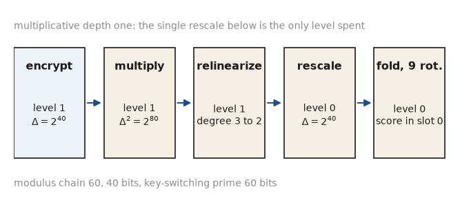
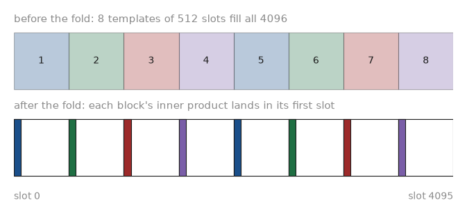
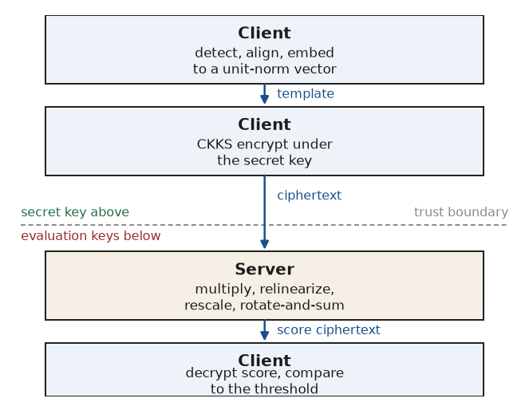
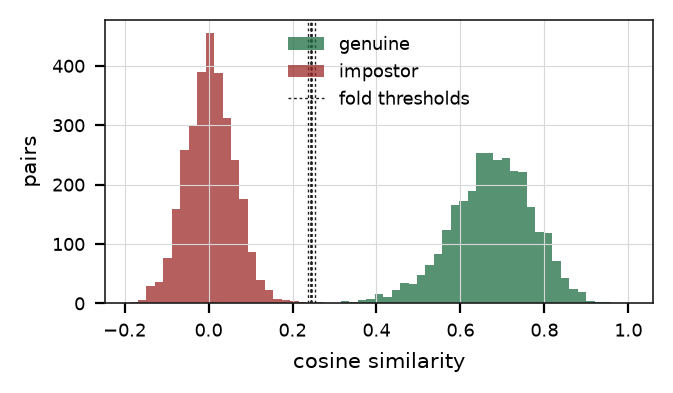
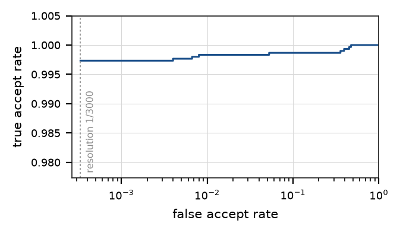
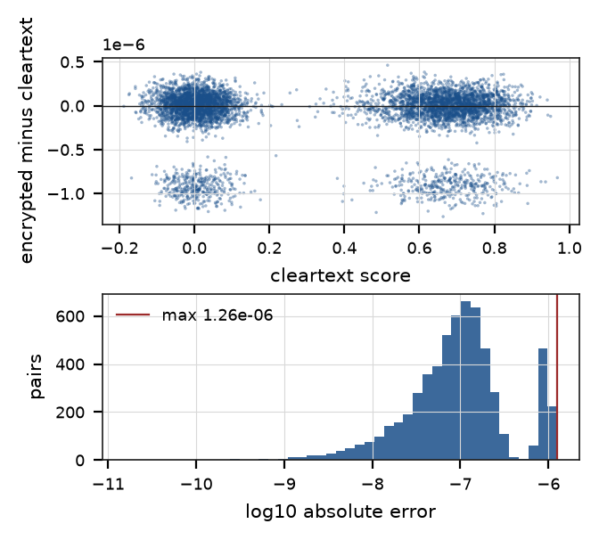
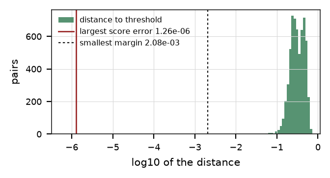
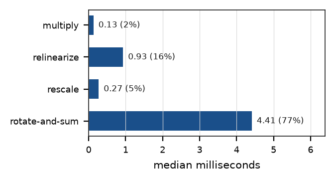
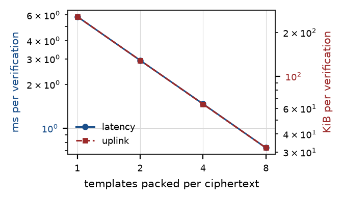
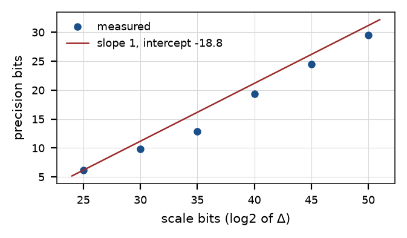

# Encrypted 1:1 Face Verification on Labeled Faces in the Wild with RNS-CKKS

**Qiyue Zhao**

Released under the MIT License.

## Abstract

We verify pairs of face images against each other while the face templates stay encrypted, and we measure what that costs. A deep network converts each photograph into a 512-dimensional unit-norm template; the client encrypts the template under RNS-CKKS; and the server computes the cosine similarity of two templates as one homomorphic inner product at multiplicative depth one, using 9 rotations to sum the element-wise products into a single slot. On the 6,000 pairs of the Labeled Faces in the Wild pair protocol, the encrypted pipeline reaches 99.87% accuracy under 10-fold cross-validation, matching the cleartext pipeline to 0.0000%. The largest difference between an encrypted score and its cleartext reference is 1.26e-06, which is 1647 times smaller than the closest any pair comes to its decision threshold. That inequality turns the observed count of 0 changed decisions into a bound: no perturbation of this magnitude can move a pair across its threshold. One verification takes 5.75 ms of server time, and packing 8 templates into the 4096 slots of one ciphertext brings that to 0.73 ms and 32.1 KiB of uplink per verification. Every number in this report is read from the JSON record of a single run, and one command reproduces it.

## 1  Introduction

A face recognition service that holds templates in the clear holds a lasting biometric identifier for every enrolled person. Templates from modern networks support reconstruction of a recognisable face and support linkage across databases, so a breach of a template store is a permanent disclosure. Homomorphic encryption offers a direct answer: the client encrypts the template, the server computes the comparison on ciphertexts, and the server holds no key.

**The comparison is one inner product.** The comparison a verification service performs is small. Two templates that carry unit L2 norm have a cosine similarity equal to their inner product, which is one element-wise multiplication followed by a sum. RNS-CKKS evaluates that at multiplicative depth one, so a single rescale suffices and bootstrapping stays out of the picture. The engineering question is what the resulting system delivers: how accurate it is on real photographs, whether encrypted arithmetic changes any accept-or-reject outcome, and how much time and bandwidth each verification costs.

This report answers those three questions with one measured pipeline that runs end to end on an arm64 laptop. The pipeline detects and aligns each face, embeds it, encrypts the embedding, scores every pair of the standard protocol under encryption, and generates this document from the resulting record.

### Contributions

- **A complete encrypted verification pipeline on real photographs.** Face detection, five-point alignment, embedding, RNS-CKKS encryption, homomorphic scoring and threshold comparison run as one command against the Labeled Faces in the Wild pair protocol, with Microsoft SEAL as the only compiled dependency.
- **Decision equivalence established as a bound instead of an observation.** Thresholds are chosen at midpoints of the observed score grid, so every pair keeps a strictly positive distance from its threshold. Reporting the ratio of the largest score error to the smallest such distance shows that no pair can cross its threshold, which is a stronger statement than a count of zero observed changes.
- **A precision model for the scoring circuit with no fitted constant.** Rescaling divides ciphertext noise by the scaling factor, so each additional scale bit buys exactly one precision bit and the predicted slope is fixed at one. The measured slope is compared against that prediction, and the intercept is reported as the noise floor of this circuit.
- **Slot packing quantified as an amortisation.** A ciphertext at degree 8192 carries 4096 slots and one template occupies 512 of them, so 8 verifications share one pass of the circuit. Latency and uplink per verification are reported against batch size.
- **Metrics that declare what the sample supports.** Each operating point carries flags recording whether the impostor count can express the requested false accept rate, and the report states the reason in place of any value the sample cannot resolve.
- **Server isolation verified at three levels.** The server sources, the compiled server objects and the linked server executable are each checked for the types that carry a secret key, and the client library is checked in the same way to confirm the test discriminates.

## 2  Related Work

Boddeti (2018) established 1:1 face matching over templates encrypted with a fully homomorphic scheme, and reported both the template size and the per-match cost that follow from packing a 512-dimensional feature into one ciphertext. Engelsma, Jain, and Boddeti (2022) extended the setting to 1:N search, where the cost of scanning a gallery dominates and the encoding of the gallery becomes the design problem. The present report stays with the 1:1 case and concentrates on what a reader needs in order to trust the numbers: the exact parameter set, the circuit trace, the bound on decision changes, and the host the timings came from.

The template frontend follows the InsightFace line of work. SCRFD (Guo et al. 2022) supplies the detector and its five landmarks, and ArcFace (Deng et al. 2019) supplies the additive angular margin objective that the recognition network is trained under and the canonical five-point template that alignment maps onto. The cryptographic scheme is CKKS (Cheon et al. 2017) in the full residue number system variant (Cheon et al. 2018), as implemented by Microsoft SEAL, with parameter widths bounded by the tables of the Homomorphic Encryption Standard (Albrecht et al. 2018).

## 3  Method

### 3.1  Templates from a deep network

Each photograph passes through three stages. The detector predicts a bounding box and five landmarks: the two eye centres, the nose tip and the two mouth corners. A similarity transform, estimated in the least-squares sense over those five points, maps them onto the canonical ArcFace template, producing a 112 by 112 crop in which the eyes and mouth occupy fixed pixel positions. The recognition network maps that crop to 512 dimensions, and the vector is scaled to unit L2 norm.

**Normalisation stays on the client.** Normalisation happens on the client, before encryption, and it is what makes the encrypted circuit small. A square root and a division are expensive under homomorphic encryption; performing them on the client leaves the server with an inner product. The provenance note below records how far the templates of this run depart from unit norm, and at that magnitude the score the server computes is the cosine similarity.

Provenance of the templates used here: LFW deep-funnelled photographs under the View 2 pair protocol: 6000 pairs in 10 folds. Faces were located with det_10g.onnx at 320 pixels, aligned onto the canonical ArcFace five-point template by a similarity transform, and embedded by w600k_r50.onnx into 512 dimensions scaled to unit L2 norm. The detector found a face in 7701 of 7701 images; the remaining 0 used the central crop implied by the funnelling registration. The largest deviation of any template from unit norm is 2.220e-16. The images came from a local LFW image tree already on the machine.

### 3.2  RNS-CKKS parameters

The polynomial modulus degree is 8192, giving 4096 plaintext slots. The coefficient modulus is a chain of primes of 60, 40, 60 bits, totalling 160 bits against the 218 bits that tc128 permits at this degree. The last prime in the chain is the key-switching prime and carries no plaintext, so the data chain holds two levels, chain index 1 and chain index 0. One step down the chain is one multiplication, so this parameter set allows exactly one. The scaling factor is 2 to the power 40.

**The widths follow from the circuit.** Those widths follow from the circuit. One ciphertext-by-ciphertext product squares the scale, and one rescale divides it by the middle prime and returns it to its original size. The prime that survives is wider than the scale it carries, which leaves room for the integer part of the score and for the accumulated noise. The measured chain confirms the arithmetic: a fresh ciphertext sits at chain index 1 and the result sits at chain index 0.

### 3.3  The scoring circuit

The server holds two encrypted templates, placed in the low slots of their respective ciphertexts, and evaluates four operations. It multiplies the two ciphertexts, which yields the element-wise products and a ciphertext of degree three. It relinearizes, returning the ciphertext to degree two. It rescales, restoring the scale and consuming the one available level. It then folds the products into a single slot with 9 rotations.

**The fold uses doubling strides.** The fold uses doubling strides. Adding a copy of the ciphertext rotated by one slot leaves each slot holding the sum of two neighbours; repeating with strides of two, four and so on up to 256 leaves slot i holding the sum of the 512 consecutive slots that begin at i. Because the template occupies a block whose length is a power of two and divides the slot count, the first slot of the block holds exactly the inner product. Galois keys are generated for those strides alone, which is why the Galois key measures 7005.3 KiB in place of the far larger key that all rotations would require.

*Figure 1: The scoring circuit, with the chain index and the scale after each step. The single rescale is the only level the parameter set can spend.*

### 3.4  Slot-packed batching

A block of 512 slots holds one template, and the ciphertext holds 4096 slots, so 8 templates fit side by side. The multiplication is element-wise and the fold is block-local, so one pass of the circuit produces 8 independent scores, each in the first slot of its block, as Figure 2 shows. The cost of that is reported below.

*Figure 2: Slot occupancy of one ciphertext before and after the fold. Each template holds a block, and the fold leaves that block's score in its first slot.*

### 3.5  Protocol and threat model

The client generates the key set, keeps the secret key, and sends the server the relinearization and Galois keys. Enrolment sends one encrypted template, which the server stores. Verification sends one encrypted probe, the server returns one encrypted score, and the client decrypts that score and compares it to the threshold. Figure 3 sets the four stages against the trust boundary.

*Figure 3: The verification pipeline. The secret key stays on the client, and the server holds evaluation keys alone.*

**The client takes the decision.** The comparison happens on the client because a threshold comparison under encryption requires a polynomial approximation to a step function, which needs multiplicative depth that this parameter set deliberately excludes. The consequence is explicit in the trust model: the server learns the ciphertexts and learns nothing about their contents, and the client learns the numeric score. A deployment in which the client should learn only the accept-or-reject bit needs either a deeper circuit or a second party, and both fall outside this report.

**The build enforces the separation.** The separation is enforced in the build. The server library and the server executable are compiled without the translation unit that holds the secret key, and a check reads the server sources, the compiled server objects and the linked executable to confirm that none of them references the types that carry a secret. The same check confirms that the client library does reference them, which shows the test distinguishes the two halves.

## 4  Experimental Setup

### 4.1  Dataset and protocol

Labeled Faces in the Wild (Huang et al. 2007) fixes 6,000 pairs in 10 folds, each fold holding pairs of the same person and pairs of different people in equal number. This run uses 3,000 same-person pairs and 3,000 different-person pairs. The fold index of every pair is carried from the protocol file into the template container and is used for cross-validation, so the accuracy reported here is comparable with published figures for the same split.

### 4.2  Thresholds and reported metrics

For each fold, the threshold is chosen to maximise accuracy on the other 9 folds and is then applied to the held-out fold. Candidate thresholds are the midpoints between adjacent distinct scores of the training split, together with one sentinel below the minimum and one above the maximum. No candidate coincides with an observed score, so every pair keeps a strictly positive distance from its threshold, and the bound of the decision-equivalence section therefore rests on an argument. The smallest such distance in this run is 2.08e-03.

**What the sample can express.** A true accept rate quoted at a false accept rate of f needs at least one impostor pair per f of the sample. With 3,000 impostor pairs the finest expressible rate is 3.33e-04. Each operating point therefore carries two flags: one recording whether the sample can express the requested rate at all, and one recording whether at least five false accepts back the estimate. Table 2 states the reason in place of any value the sample cannot resolve.

### 4.3  Host and build

Apple M1 on macOS 26.6.1, arm64, 8 physical cores and 8 GiB of memory. Compiled by AppleClang 21.0.0.21000101 in the Release configuration against Microsoft SEAL 4.3.3, with serialization compression set to zstd. This build is a native arm64 Release build, so the latencies below describe the host directly. Floating-point contraction is switched off at compile time, so the cleartext reference scores are plain IEEE-754 double arithmetic and agree bit for bit across hosts that would otherwise differ in their use of fused multiply-add.

**Provenance of every number.** The record this document was generated from is artifacts/results.json, and the per-pair scores are in artifacts/scores.csv. The benchmark performed 750 homomorphic scoring calls at a batch of 8 to cover all 6,000 pairs. Every number in this report occupies a named slot filled from that record when the report is generated, and reports/data_slots.md lists each slot together with the path it was read from.

## 5  Results

**Each experiment stands on its own.** The subsections below report six experiments. The first scores every pair of the protocol and is the source of every accuracy and fidelity figure. The others each generate their own key set and draw their own sample: the cost measurement times 20 unbatched verifications, the batching measurement times 10 at each batch size, and the scale sweep measures a short sample at each scaling factor. Medians and maxima therefore differ between tables by a few percent, and each table reports the experiment that produced it. Where two numbers for the same quantity appear, the text names which experiment each came from.

### 5.1  Verification accuracy

Table 1 reports the 10-fold accuracy of both pipelines. The encrypted pipeline reaches 99.87% with a standard deviation of 0.19% across folds, against 99.87% for the cleartext pipeline. The gap is 0.0000%.

The area under the receiver operating characteristic is 0.999417 and the equal error rate is 0.267%. The separation between the two score distributions, measured as the difference of their means over their pooled standard deviation, is 7.99. Figure 4 shows the two distributions with the fitted thresholds, and Figure 5 the operating curve they produce.

*Table 1: Verification accuracy under the fold protocol. Thresholds are fitted without the fold they are applied to.*

| Quantity | Cleartext | Encrypted |
|---|---|---|
| Accuracy, mean over folds | 99.87% | 99.87% |
| Accuracy, standard deviation | 0.19% | 0.19% |
| Area under the ROC curve | 0.999417 | 0.999417 |
| Equal error rate | 0.267% | 0.267% |
| Threshold, mean over folds | 0.2442 | 0.2442 |
| Separation of the distributions | 7.99 | 7.99 |

*Table 2: Operating points on the cleartext scores. A rate the impostor count cannot express carries no value.*

| Target rate | True accept | Achieved | False accepts | Backed |
|---|---|---|---|---|
| 1e-02 | 99.83% | 1.00e-02 | 30 | yes |
| 1e-03 | 99.73% | 1.00e-03 | 3 | coarse |
| 1e-04 | not reported | — | — | no |

One requested rate is left without a value, because the sample cannot express it: a false accept rate of 0.000100 needs at least 10000 impostor pairs; this set has 3000, so no value is reported. Reporting a value there would describe the position of a handful of individual pairs in the score ordering and would carry no information about the rate itself.

*Figure 4: Cleartext score distributions with the fitted fold thresholds.*

*Figure 5: Receiver operating characteristic. The dashed line marks the finest false accept rate the impostor count can express.*

### 5.2  Numerical fidelity

Across all 6,000 pairs, the difference between the encrypted score and its cleartext reference has a mean absolute value of 2.01e-07, a median of 9.81e-08, a 99th percentile of 1.09e-06 and a maximum of 1.26e-06. The maximum corresponds to 19.6 bits of precision, which matches the headroom the parameter set provides: the surviving prime is 60 bits wide and carries a scale of 40 bits, leaving 20 bits before the accumulated noise of the multiplication and the fold is subtracted. Figure 6 shows the difference against the cleartext score and its distribution.

**A maximum belongs to its sample.** A maximum is the largest value in a sample, so it grows with coverage and moves with the key set. The figure above, 1.26e-06, is the maximum over all 6,000 pairs under the session that scored them. The cost measurement of Section 5.4 records 3.74e-07 over its 20 repetitions, the batching measurement of Section 5.5 records 1.54e-06 at a batch of one, and the scale sweep of Section 5.6 records 1.45e-06 at this scaling factor. Each is correct for its own sample and its own keys. The bound of Section 5.3 uses the figure from the full protocol, because that is the one that covers every pair a decision is taken on.

*Figure 6: Signed difference against cleartext score over the full protocol, and the distribution of the absolute difference.*

### 5.3  Decision equivalence

A pair changes its accept-or-reject outcome only when the encrypted score lands on the far side of the threshold from the cleartext score. Write E for the largest absolute difference between the two scores over all pairs, and M for the smallest distance from any cleartext score to the threshold of its fold. When E is smaller than M, every encrypted score stays on the side of the threshold its cleartext reference occupies, and the two pipelines agree on every pair.

This run measures E as 1.26e-06 and M as 2.08e-03, giving a ratio of 6.07e-04. The ratio lies below one by a factor of about 1647, so the equality of the two decision sets holds by the inequality and does not depend on the particular noise this run drew. The observed count of 0 changed decisions is what the bound requires.

**Why the margin is positive.** The midpoint threshold grid is what makes M positive. A threshold placed at an observed score value would leave one pair at zero distance, the ratio would be unbounded, and a count of zero changed decisions would then rest on the accident that the noise happened to point the right way. Figure 7 places the two distributions on one axis, where the separation between them is the bound.

*Figure 7: Distances from each cleartext score to the threshold of its fold, against the largest score error. The gap between them is the bound.*

### 5.4  Cost of one verification

Table 3 reports medians over 20 unbatched repetitions. Server time for the circuit that encrypts both templates is 5.75 ms, of which the fold accounts for 4.41 ms, or 77% of the total. Figure 8 gives the share each stage takes. The end-to-end figure, adding client encryption and decryption, is 10.52 ms.

**A cleartext gallery costs less.** Keeping the enrolled template in the clear removes the relinearization from the critical path and brings server time to 4.74 ms, a saving of 18%. That saving is the price of the privacy property: in the cleartext-gallery variant the server holds the enrolled template and learns the identity it stores.

*Table 3: Cost of one unbatched verification with both templates encrypted. Times are medians; sizes are serialised bytes.*

| Stage | Cost | Note |
|---|---|---|
| Key generation | 35.22 ms | once per client |
| Client encryption | 4.57 ms | two templates |
| Server multiply | 0.13 ms | depth 1 |
| Server relinearize | 0.93 ms | one key switch |
| Server rescale | 0.27 ms | level 1 to 0 |
| Server rotate-and-sum | 4.41 ms | 9 rotations |
| **Server total** | **5.75 ms** |  |
| Client decryption | 0.21 ms | one ciphertext |
| Uplink per verification | 257.1 KiB | probe ciphertext |
| Downlink per verification | 128.6 KiB | score ciphertext |
| Relinearization key | 771.3 KiB | sent once |
| Galois key | 7005.3 KiB | 9 strides, sent once |

*Figure 8: Where the server spends its time inside one verification.*

Replacing the doubling-stride fold with one that rotates by a single slot 511 times raises server time to 253.73 ms, a factor of 44.1, and raises the largest score error to 1.24e-04 against 3.74e-07 for the doubling fold over the same repetitions.

**Rotations and noise scale differently.** The two effects carry different exponents, and separating them explains why the doubling fold wins twice. Counting rotations, the single-slot fold performs d minus 1 of them against log2 d for the doubling fold, which is linear against logarithmic and gives the speed factor. Counting noise, each rotation is a key switch and every key switch adds a unit: the k-th term of the single-slot chain has been rotated k times, so summing the chain accumulates d(d minus 1)/2 units, while the doubling fold doubles its accumulated noise at each of its log2 d steps and ends at d minus 1. The first ratio is quadratic in the second, which is the precision factor.

### 5.5  Slot-packed batching

Server time stays close to constant as the batch grows, because the circuit is the same at every batch size: 5.85 ms at a batch of 1 and 5.86 ms at a batch of 8. Amortised over the batch, that is 0.73 ms and 32.1 KiB of uplink per verification, a throughput of 1364 verifications per second of server time, which Figure 9 plots against batch size. The largest score error at the full batch is 1.70e-06, against 1.54e-06 at a batch of one. Those two lie within the spread that independent experiments show at this parameter set, so packing carries no cost in precision that this measurement can separate from run-to-run variation. Table 4 gives every batch size.

*Table 4: Cost per verification against the number of templates packed into one ciphertext.*

| Batch | Server time | Per pair | Uplink each | Max error |
|---|---|---|---|---|
| 1 | 5.85 ms | 5.85 ms | 257.1 KiB | 1.54e-06 |
| 2 | 5.85 ms | 2.93 ms | 128.6 KiB | 1.56e-06 |
| 4 | 5.88 ms | 1.47 ms | 64.3 KiB | 1.66e-06 |
| 8 | 5.86 ms | 0.73 ms | 32.1 KiB | 1.70e-06 |

*Figure 9: Amortised latency and uplink per verification against batch size. Both axes are logarithmic.*

### 5.6  Scaling factor and precision

**One scale bit buys one precision bit.** A CKKS plaintext holds the message multiplied by the scaling factor and rounded, so decoding returns the message plus the ciphertext noise divided by that factor. The noise depends on the widths of the moduli and on the number of key switches, and not on the scaling factor, so doubling the factor halves the absolute error. The predicted slope of precision against scale bits is therefore exactly one, and no constant in that prediction is available to tune against the data.

The sweep measures a slope of 0.957 over 6 usable points, a deviation of -0.043 from the prediction, with a coefficient of determination of 0.9880 and a largest residual of 1.83 bits. The intercept, -18.83 bits, is the noise floor of this circuit on this host and is reported as a measurement. Figure 10 draws the measured points against the predicted slope.

**The chain follows the scale.** The sweep moves the middle prime with the scale. At a scale of s bits the chain is 60, s, 60, so the rescale divides by a prime of the same width as the scale and the identity of Section 3.2 holds at every point. The prime that survives stays 60 bits wide, which is what the headroom column reports, and the total width of the chain runs from 145 bits at the narrowest scale to 170 bits at the widest, both inside the 218 bits the security level permits at this degree.

**The sweep has its own sample.** Each point of the sweep measures its own short sample under its own key set, so the maximum it records at the working scale of 40 bits, 1.45e-06, is a different statistic from the maximum over all 6,000 pairs reported in Section 5.2. The precision column follows the same rule, which is why its entry at that scale reads 19.4 bits against the 19.6 bits the full protocol gives. The slope is unaffected, because every point of the fit is drawn the same way.

*Table 5: Measured precision against the scaling factor. Headroom is the width of the surviving prime less the scale.*

| Scale bits | Headroom | Max error | Precision | Server time |
|---|---|---|---|---|
| 25 | 35 bits | 1.40e-02 | 6.2 | 5.86 ms |
| 30 | 30 bits | 1.09e-03 | 9.8 | 5.86 ms |
| 35 | 25 bits | 1.38e-04 | 12.8 | 5.76 ms |
| 40 | 20 bits | 1.45e-06 | 19.4 | 5.75 ms |
| 45 | 15 bits | 4.14e-08 | 24.5 | 5.75 ms |
| 50 | 10 bits | 1.29e-09 | 29.5 | 5.75 ms |

*Figure 10: Measured precision against scale bits, with the slope-one prediction drawn through the measured intercept.*

### 5.7  End-to-end protocol

A single verification was carried out across two operating system processes communicating through files, with the server process holding no secret key. That process evaluated the circuit once, from a cold start, in 11.88 ms, and the client spent 0.26 ms decrypting the result. The decrypted score was 0.711842 against a cleartext reference of 0.711841, a difference of 1.02e-06. The pair was a same-person pair, and the decision at a threshold of 0.2529 was to accept, which agrees with the ground truth.

**Why these differ from the table.** Two of those figures invite comparison with Table 3 and measure something else. The evaluation time is a single call in a process that has just started, so it carries the one-time costs of building the evaluator's tables and touching its memory for the first time; the table reports a median over repetitions that pay those costs once and then amortise them away. The probe ciphertext occupied 229.6 KiB on disk and the returned score 128.1 KiB, against the 257.1 KiB and 128.6 KiB the table gives, because the table reports the upper bound the library returns for a compressed stream while the files hold the bytes actually written.

## 6  Discussion

Three properties of the setting combine to make encrypted 1:1 verification inexpensive. The comparison is a single inner product, so multiplicative depth one suffices and the modulus chain stays short. The templates carry unit norm from the client, so the server performs no division and no square root. And the slot structure of the ciphertext holds 8 templates at this dimension, so a service under load amortises one pass of the circuit over that many verifications.

**Precision to spare.** The precision result explains why accuracy survives encryption so comfortably. The circuit resolves about 20 bits, and the decisions in a verification task depend on distances between scores that are about 1647 times larger than the error. The margin between what the arithmetic delivers and what the task needs is wide enough that the parameter set could trade precision for speed, and Table 5 quantifies that trade directly.

## 7  Limitations

- The threshold comparison happens on the client, so the client learns the numeric score. A deployment that should reveal only the accept-or-reject bit needs a deeper circuit or a second party.
- The parameter set allows exactly one multiplication, as Section 3.2 sets out. A circuit that normalises templates under encryption, or that compares against a threshold under encryption, needs a longer modulus chain and costs more.
- The evaluation covers 1:1 verification. Searching a gallery of size N costs N times the work reported here before any gallery-specific encoding is applied, and the encodings that make such a search practical are a separate problem.
- The impostor count of 3,000 bounds the false accept rates this sample can express, and Table 2 reports which requested rates fall outside that bound.
- Timings come from one host, named above, under a single-threaded evaluator. They describe that machine and scale with its clock and memory system.
- Accuracy depends on the frontend network as much as on the protocol. The encrypted arithmetic reproduces whatever the frontend produces, and a different recognition model moves the accuracy figures while leaving the cost figures and the equivalence bound intact.

## 8  Conclusion

A face verification service can hold templates encrypted and still decide as well as one that holds them in the clear. On the 6,000 pairs of the standard protocol, the encrypted pipeline reaches 99.87% accuracy and agrees with the cleartext pipeline on every pair, with a bound establishing that agreement. One verification costs 5.75 ms of server time and 257.1 KiB of uplink, falling to 0.73 ms and 32.1 KiB when 8 verifications share one ciphertext. The whole measurement takes 14 seconds of benchmark time on the host named above, and one command reproduces it.

## References

1. Albrecht, M.; Chase, M.; Chen, H.; Ding, J.; Goldwasser, S.; Gorbunov, S.; Halevi, S.; Hoffstein, J.; Laine, K.; Lauter, K.; Lokam, S.; Micciancio, D.; Moody, D.; Morrison, T.; Sahai, A.; and Vaikuntanathan, V. 2018. Homomorphic Encryption Security Standard. Technical report, HomomorphicEncryption.org.
2. Boddeti, V. N. 2018. Secure Face Matching Using Fully Homomorphic Encryption. In IEEE International Conference on Biometrics Theory, Applications and Systems (BTAS), 1–10.
3. Cheon, J. H.; Han, K.; Kim, A.; Kim, M.; and Song, Y. 2018. A Full RNS Variant of Approximate Homomorphic Encryption. In Selected Areas in Cryptography (SAC), 347–368.
4. Cheon, J. H.; Kim, A.; Kim, M.; and Song, Y. 2017. Homomorphic Encryption for Arithmetic of Approximate Numbers. In Advances in Cryptology (ASIACRYPT), 409–437.
5. Deng, J.; Guo, J.; Xue, N.; and Zafeiriou, S. 2019. ArcFace: Additive Angular Margin Loss for Deep Face Recognition. In IEEE/CVF Conference on Computer Vision and Pattern Recognition (CVPR), 4690–4699.
6. Engelsma, J. J.; Jain, A. K.; and Boddeti, V. N. 2022. HERS: Homomorphically Encrypted Representation Search. IEEE Transactions on Biometrics, Behavior, and Identity Science, 4(3): 349–360.
7. Guo, J.; Deng, J.; Lattas, A.; and Zafeiriou, S. 2022. Sample and Computation Redistribution for Efficient Face Detection. In International Conference on Learning Representations (ICLR).
8. Huang, G. B.; Ramesh, M.; Berg, T.; and Learned-Miller, E. 2007. Labeled Faces in the Wild: A Database for Studying Face Recognition in Unconstrained Environments. Technical Report 07-49, University of Massachusetts, Amherst.
9. Microsoft Research. Microsoft SEAL (release 4.3.3). https://github.com/microsoft/SEAL.
